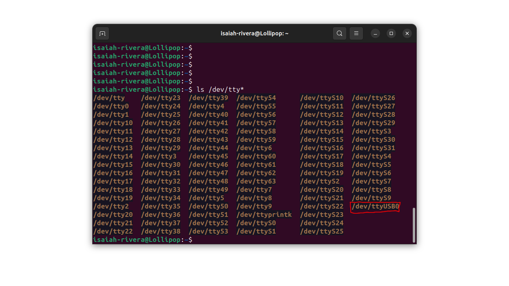
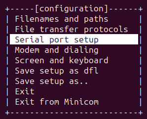
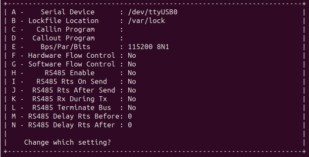
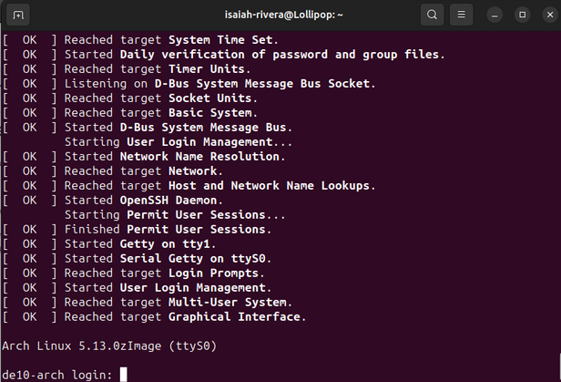

# How to boot embedded linux on de10 Nano 

## Loading Embedded Linux onto DE10 Nano
After generating or downloading an embedded linux image use this command to write the image to a sd card: 

```
# Ex: sd card location = /dev/sda
# Ex: sdcard image file = sdcard.img

sudo dd if=sdcard.img of=/dev/sda bs=64K status=progress
```

Insert the sd card into the sd card slot on the DE10 Nano. After plug the Mini-B USB cable into the J4 port


Check what serial port the DE10 Nano is connected to using the following command: 

```
ls /dev/tty*
```



For me it was connected under /dev/ttyUSB0.

## Configuring Minicom
Use the following command to install minicom: 
```
sudo apt-get install minicom
```


Now minicom needs to be setup to work with the DE10 Nano. To change minicom settings use the following command
```
sudo minicom -s
```

You should see the following screen. Go to Serial Port setup and click enter



Change your settings to match the following: 



After this exit the minicom and enter the following command to acess the port

```
# Replace /ttyUSBO with the port your DE10 Nano is connceted to

sudo minicom /dev/ttyUSB0
```

Now plug the DC PoweSupply into the DE10 Nano. If you are using an arch linux arm it you should see the following screen pop up: 



If you see this screen then congrats! 